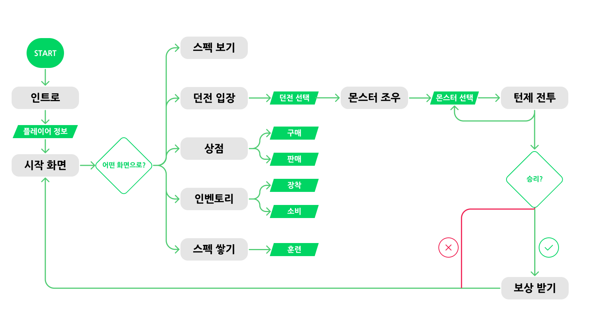

# 🦃 SPARTA-TEXT-RPG

🎮 SPARTA Unity 12기 7조의 텍스트 기반 C# RPG 프로젝트

---

## 📑 목차

- [실행 방법](#실행-방법)
- [발표 자료 & 문서](#발표-자료--문서)
- [프로젝트 개요](#프로젝트-개요)
- [게임 플레이 흐름](#게임-플레이-흐름)
- [프로젝트 설명](#프로젝트-설명)
  - [1. Tech Stack](#1-tech-stack)
  - [2. Architecture](#2-architecture)
- [기능 설명](#기능-설명)
  - [1. 플레이어 시스템](#1-플레이어-시스템)
  - [2. 던전 선택](#2-던전-선택)
  - [3. 전투 시스템](#3-전투-시스템)
  - [4. 상점 시스템](#4-상점-시스템)
  - [5. 인벤토리 시스템](#5-인벤토리-시스템)
  - [6. 훈련 기능](#6-훈련-기능)
  - [7. Scene 전환 구조](#7-scene-전환-구조)
- [트러블슈팅](#트러블슈팅)
- [팀 소개](#팀-소개)
- [Developers](#developers)
- [Ground Rule & 협업 방식](#ground-rule--협업-방식)
- [한줄 요약](#한줄-요약)

---

## [실행 방법]

### 1. 저장소 클론

```bash
git clone https://github.com/shin0112/SPARTA-TEXT-RPG.git
```

### 2. Visual Studio 실행

- `SPARTA-TEXT-RPG.sln` 파일 열기
- `Program.cs` 선택 후 Ctrl + F5 실행

## [발표 자료 & 문서]

> 넣을 것만 넣기

## [참고 자료]

<table>
  <tr>
    <th>문서</th>
    <th>링크</th>
  </tr>
  <tr>
    <td>발표 자료 (PDF)</td>
    <td><a href="https://drive.google.com/your-slide-link" target="_blank">발표 슬라이드 보기</a></td>
  </tr>
  <tr>
    <td>UML 구조도</td>
    <td><a href="./Docs/uml-diagram.png" target="_blank">UML 다이어그램 보기</a></td>
  </tr>
  <tr>
    <td>Figma 와이어프레임</td>
    <td><a href="https://www.figma.com/design/9uOBBRzgsTEd0DpK92gFKa/TEXT-RPG?node-id=0-1&t=L8mwcZmhaGIM1F0G-1" target="_blank">Figma 보기</a></td>
  </tr>
</table>

## [프로젝트 개요]

| 항목       | 내용                                   |
| ---------- | -------------------------------------- |
| 프로젝트명 | 본격! 취준생 키우기                    |
| 주제       | 취준생 키우기 콘셉트의 텍스트 기반 RPG |
| 개발 인원  | 총 5명 (개발자)                        |
| 개발 기간  | 2025.10.14 ~ 2025.10.21 (총 7일)       |
| 개발 목적  | C# 객체지향 설계 및 팀 협업 실습       |

---

## [게임 플레이 흐름]

1. **IntroScene** — 이름/직업 선택
2. **StartScene** — 메인 화면
3. **DungeonScene** — 던전 난이도 선택
4. **BattleScene** — 전투 진행
5. **ShopScene** — 아이템 구매·판매
6. **InventoryScene** — 장비 장착 및 능력치 관리
7. **TrainingScene** — 스테미나로 경험치 획득

## 

## [프로젝트 설명]

### 1. Tech Stack

| 구분            | 기술                                                                                                                  |
| --------------- | --------------------------------------------------------------------------------------------------------------------- |
| Language        |                   |
| Framework       |                   |
| IDE             |  |
| Version Control |                 |
| Design          |                   |
| Documentation   |                 |

---

### 2. Architecture

```plaintext
SPARTA-TEXT-RPG/
├─ Core/              # Player, Monster, Item 등 핵심 클래스
├─ Manager/           # GameManager, BattleManager, InventoryManager
├─ Repository/        # MonsterRepository, PlayerRepository 등
├─ Scene/             # Start, Battle, Shop, Inventory 등
├─ Config/            # GlobalConfig 및 상수 정의
└─ Program.cs         # 실행 진입점
```

---

## [기능 설명]

### 1. 플레이어 시스템

- 이름과 직업 입력 후 게임 시작
- 스탯(체력, 스테미나, 공격력, 방어력 등) 관리
- 장착 아이템에 따른 능력치 변화
- 던전 클리어 시 보상(골드, 아이템) 자동 수령
- 레벨업 및 경험치 시스템 구현

### 2. 던전 선택

- 플레이어 레벨에 따른 입장 제한
- 사망 시 던전 입장 불가
- 입장 시 해당 난이도에 따른 몬스터 생성

### 3. 전투 시스템

- `IAttack` / `IAttackable` 인터페이스 기반 전투 구조
- 턴제 전투 구조 (`Player → Monster → Player ...`)
- 랜덤 몬스터 스폰 (던전별 난이도 및 몬스터 컨셉 적용)
- `OnAllMonsterDead` 이벤트 기반 전투 종료 처리
- 승리 시 보상 지급 / 패배 시 던전 탈출

### 4. 상점 시스템

- 아이템 구매 / 판매 / 골드 차감 기능
- 아이템 구매
  - 장비, 소비 아이템 구매 가능
  - 장비 아이템: 개수 제한을 두어 판매 시 [Sold Out] 표기
  - 소비 아이템: 다중 개수 구매 가능
- 아이템 판매
  - 장착 중인 아이템을 판매할 경우, 해제된 후 판매
  - 소비 아이템: 다중 개수 판매 가능
  - 판매 시 정가의 80%로 환급
- 거래 후 `InventoryManager` 즉시 연동

### 5. 인벤토리 시스템

- 아이템 확인 / 장착 / 해제 / 소비
- 인벤토리 변경 시 콘솔 UI 즉시 갱신
- 장착 관리
  - 장착 시 능력치 자동 반영
  - 장착 중인 아이템 표기
  - 같은 타입은 1개만 착용 가능 (무기 / 방어구)
- 소비 아이템 관리
  - 보유 중인 소비 아이템 사용 가능

### 6. 훈련 기능

- 스테미나 소모 → 경험치 획득

### 7. Scene 전환 구조

- `GameManager`가 전체 흐름(Scene 전환)을 제어
- `SceneType` Enum을 통해 씬 이동 관리

---

## [트러블슈팅]

> 개발 중 발생한 주요 이슈 및 해결 과정을 정리했습니다.  
> 각 항목은 별도 TIL 또는 블로그 포스트로 링크됩니다.

| 주제                              | 요약                                              | 링크                                                                                                                                                                                                                                                                   |
| --------------------------------- | ------------------------------------------------- | ---------------------------------------------------------------------------------------------------------------------------------------------------------------------------------------------------------------------------------------------------------------------- |
| 몬스터 상태 초기화 이슈           | BattleManager와 Repository 간 참조 공유 문제 해결 | [🔗 [C#] 리팩토링 과정에서 발생한 객체 참조 공유 문제](https://velog.io/@shin0112/C-%EB%A6%AC%ED%8C%A9%ED%86%A0%EB%A7%81-%EA%B3%BC%EC%A0%95%EC%97%90%EC%84%9C-%EB%B0%9C%EC%83%9D%ED%95%9C-%EA%B0%9D%EC%B2%B4-%EC%B0%B8%EC%A1%B0-%EA%B3%B5%EC%9C%A0-%EB%AC%B8%EC%A0%9C) |
| Scene 순환 참조 문제              | GameManager와 Scene 간 의존성 해소                | [🔗 작성 중 / TIL 예정]()                                                                                                                                                                                                                                              |
| 맥 ↔ 윈도우 아스키 코드 변환 충돌 | `Console.UTF8` 설정으로 라인 엔딩 통일            | [🔗 작성 중 / TIL 예정]()                                                                                                                                                                                                                                              |

---

## [팀 소개]

| 이름       | 역할             | 주요 담당                                    |
| ---------- | ---------------- | -------------------------------------------- |
| **신주은** | 팀장 / 설계 총괄 | 전투 로직, Scene 구조, Git 관리              |
| **유가영** | UI / 발표        | 인트로, 시작 화면, 발표자료 제작             |
| **이하람** | 인벤토리 담당    | 아이템, 인벤토리 관리, 장비 / 포션 로직 관리 |
| **정지원** | 상점 담당        | 구매·판매, 아이템 리스트 관리, 발표자료 제작 |
| **황준영** | 시스템 담당      | 플레이어, 몬스터, 공격 로직, 전투 밸런스     |

## [Developers]

<table>
    <tr align="center">
        <td><B>신주은</B></td>
        <td><B>유가영</B></td>
        <td><B>이하람</B></td>
        <td><B>정지원</B></td>
        <td><B>황준영</B></td>
    </tr>
    <tr align="center">
        <td>
            
            <br>
            <a href="https://github.com/shin0112" target="_blank"><i>shin0112</i></a>
        </td>
        <td>
            
            <br>
            <a href="https://github.com/Gayeong-you" target="_blank"><i>Gayeong-you</i></a>
        </td>
        <td>
            
            <br>
            <a href="https://github.com/haramey123" target="_blank"><i>haramey123</i></a>
        </td>
        <td>
            
            <br>
            <a href="https://github.com/checkmate0710" target="_blank"><i>checkmate0710</i></a>
        </td>
        <td>
            
            <br>
            <a href="https://github.com/PeacefulKim" target="_blank"><i>PeacefulKim</i></a>
        </td>
    </tr>
</table>
---

## [Ground Rule & 협업 방식]

### Ground Rule

- UML 설계 → Figma 와이어프레임 → 코드 작성
- 브랜치별 역할 분담 및 코드리뷰

### Git Strategy

- `main` → `own's branch` → `PR` → 코드리뷰 → Merge

### Commit Convention

```
feat: 기능 추가
fix: 버그, 오류 수정
refactor: 기능 추가 x, 코드 리팩토링
style: 주석 추가, 공백 라인 제거 등등 자잘한 수정
rename: 변수, 메서드, 파일, 폴더 등 이름 변경
move: 파일 이동
test: 테스트 코드 작성
docs: readme 등 문서 작성 및 수정
chore: 환경 설정 변경 (ex. .gitignore)
```

## 한줄 요약

> 객체지향 설계 원칙을 기반으로, Scene 간 독립성과 이벤트 기반 전투 시스템을 구현한 콘솔 RPG 프로젝트입니다.
